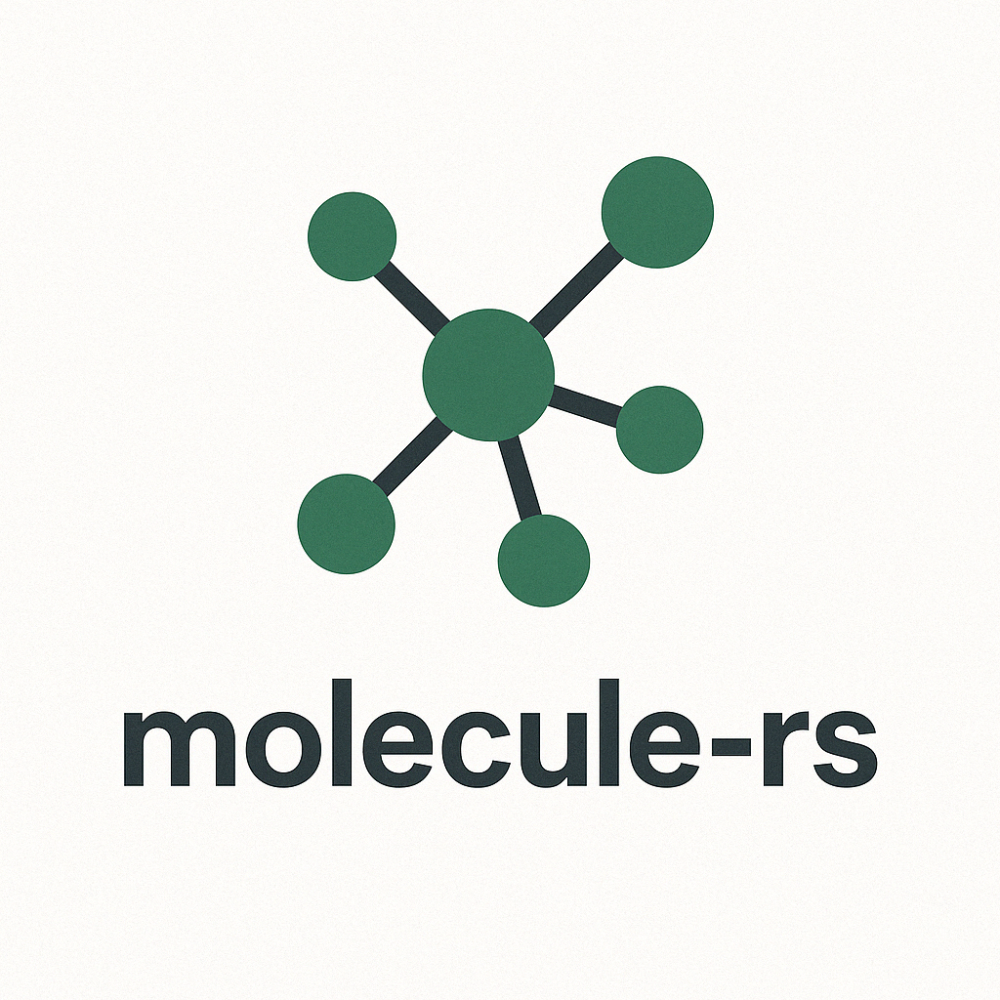

<p align="center">
  
</p>

online demo: [technoabsurdist.github.io/molecule-rs/](technoabsurdist.github.io/molecule-rs/)

## molecule-rs

molecule-rs is a high-performance molecular visualization and analysis toolkit built with Rust. It's designed to parse, process, and visualize molecular structures.

**Prerequisites**

- Rust and Cargo
- wasm-pack (for WebAssembly compilation)
- Node.js and npm (for the web demonstration)

**Building the Core Library**

```bash
cargo build --release
```

**Building the WebAssembly Module**

```bash
cd molecule-wasm
wasm-pack build
```

**Running the Web Demonstration**

```bash
cd molecule-web
npm install
npm start
```

Then open your browser to http://localhost:8080.

**Contributing**

Contributions are very welcome. Please feel free to submit a PR.

## License

MIT
